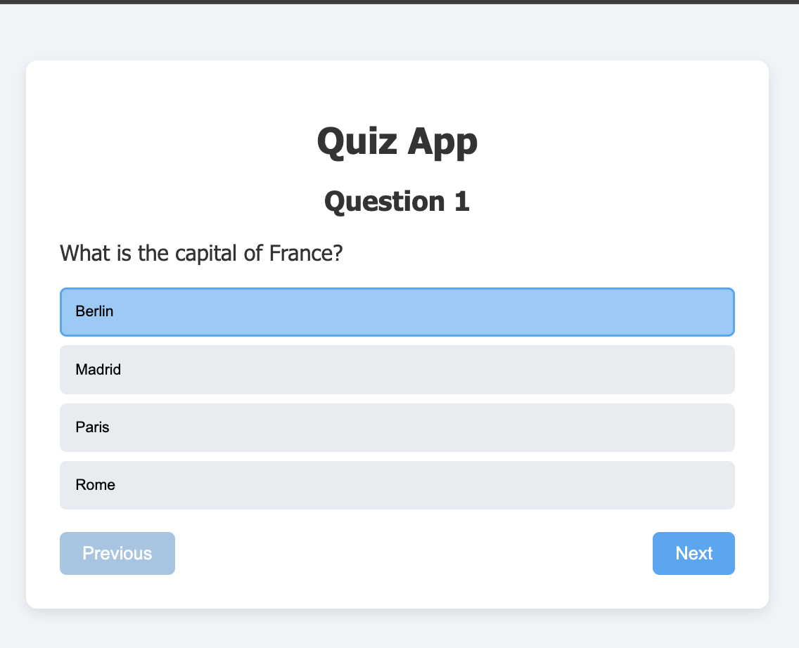
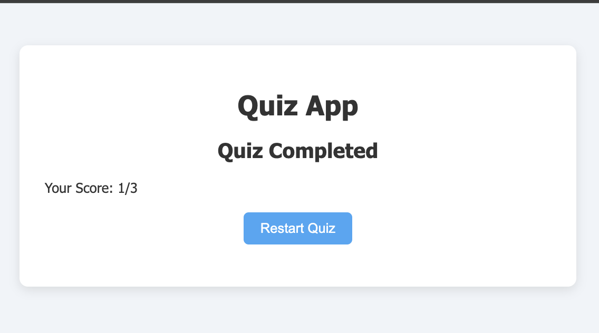

# React Quiz App 🧠⚡

A simple **Quiz App** built while learning **React**.  
It allows users to answer multiple-choice questions, navigate between questions, and finish the quiz to view the results.

## Screenshots

### Quiz Screen

### Results Screen

## Features

- Multiple-choice quiz questions
- Highlights the selected answer
- Next / Previous navigation
- Finish quiz on the last question
- Results screen after completion

## Tech Stack

- React
- JavaScript
- CSS
- Vite (if you created the project using Vite)

